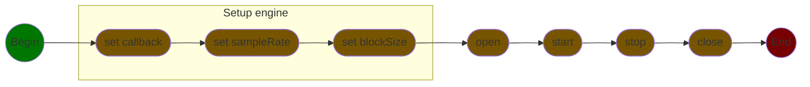

## Minimal code example
C++ version : 26

### 1. import the audio core

```cpp
import audio.<type>;
```

| type      | alsa  | jack  | pipewire | pulseaudio | wasapi  | asio    | ds      | wmme    | coreaudio |
|-----------|-------|-------|----------|------------|---------|---------|---------|---------|-----------|
| supported | no    | yes   | no       | no         | no      | no      | no      | no      | no        |
| plateform | linux | linux | linux    | linux      | windows | windows | windows | windows | macos     |


replace with the desire plateform.

### 2. configuration
 ```c++
void <callback_name>(const BlockView& input, BlockView& output) {

}

int main() {
    Backend backend;
 
    auto list = backend.getDevices();
  
    auto deviceSelected = list[n];
 
    auto capability = backend.getCapabilities(deviceSelected);
 
    DeviceConfig config = {
        deviceSelected
        capability.samplerate[0],
        ...
    };
 
    if(backend.open(config).failed()) {
 		std::println("[param] : x unsupported with [param] y");
 		std::println("supported values : [a, b, ..., c]");
		return;
    }
 
    backend.setCallback(<callback_name>);
    
    backend.start();
 
    while(/*isAlive*/) {
        ...
    }
 
    backend.stop();
    backend.close();
}
```
> [!WARNING]
> The callback function **must obligatory** respect this signature. 

**2.4 - mka::audio::BlockView structure**

```cpp
block.frames();                     // get frame count
block.channels();                   // get channel count
block.channel(<n>);                 // get n-channel
block.clear();                      // fill block with 0
```

Thanks to this structure you can operate over the buffer and access to related datas like samplerate, channels and frames.

### 3. pipeline

your code must following this pipeline :


