# mka-core-audio

**mka-core-audio** is a C++ real-time audio framework designed to provide a **backend-agnostic, low-latency audio layer** for professional audio applications such as digital audio workstations (DAWs), synthesizers, audio plugins and signal-processing software.

The project is built around one central idea:

> **Hide platform and audio-backend differences behind a small, predictable and real-time-safe C++ interface.**

The framework is intended to become the audio foundation of a future DAW and other audio software developed within the MKA ecosystem.

---

## Goals

The main goals of the project are:

* Low-latency real-time audio processing
* Cross-platform architecture
* Backend-independent public API
* Unified input/output endpoint model
* Strict separation between control and real-time audio code
* No dynamic allocation in the real-time processing path
* Fixed-size framework processing blocks
* Support for different backend buffer sizes
* Unified floating-point audio buffers at the framework level
* Minimal and predictable API
* Modern C++ architecture using C++ modules

The framework is deliberately designed to avoid exposing backend-specific concepts to the rest of the application.

---

## Architecture

The framework is organized into several layers.

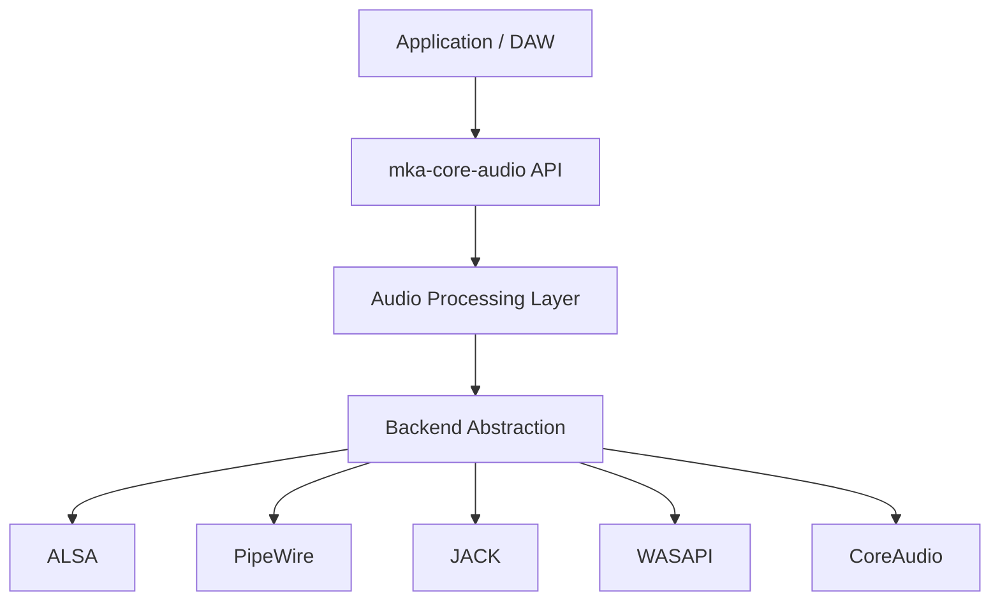
```mermaid
flowchart TD
    APP["Application / DAW"]

    API["mka-core-audio API"]
    PROCESSING["Audio Processing Layer"]
    BACKEND["Backend Abstraction"]

    ALSA["ALSA"]
    PIPEWIRE["PipeWire"]
    JACK["JACK"]
    WASAPI["WASAPI"]
    COREAUDIO["CoreAudio"]

    APP --> API
    API --> PROCESSING
    PROCESSING --> BACKEND

    BACKEND --> ALSA
    BACKEND --> PIPEWIRE
    BACKEND --> JACK
    BACKEND --> WASAPI
    BACKEND --> COREAUDIO
```

The application interacts only with the abstract audio interface.

Backend implementations are responsible for translating that interface into the native concepts of the underlying audio system.

---

# Backend abstraction

A backend should not force the rest of the framework to understand its own API.

For example:

* ALSA exposes PCM devices and hardware parameters.
* PipeWire exposes nodes and streams.
* JACK exposes ports and clients.
* CoreAudio exposes devices and streams.
* WASAPI exposes devices and audio clients.

These concepts are different, but the framework exposes them through a common abstraction.

The backend therefore becomes an implementation detail.

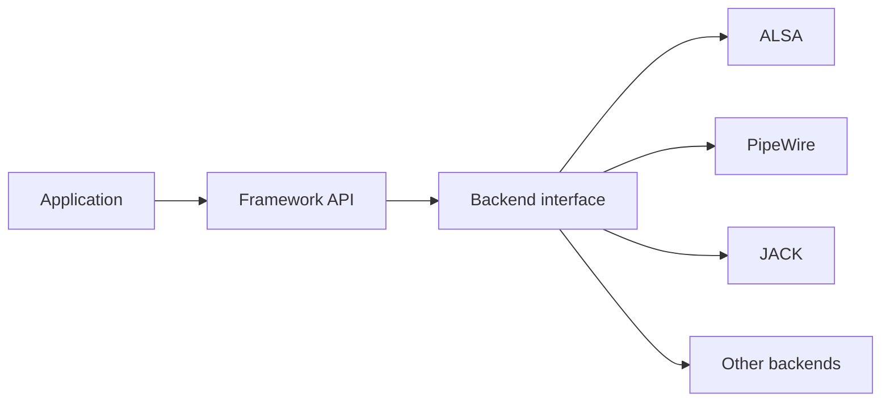
```mermaid
flowchart LR
    APP["Application"]

    API["Framework API"]
    BACKEND["Backend interface"]

    ALSA["ALSA"]
    PIPEWIRE["PipeWire"]
    JACK["JACK"]
    FUTURE["Other backends"]

    APP --> API
    API --> BACKEND

    BACKEND --> ALSA
    BACKEND --> PIPEWIRE
    BACKEND --> JACK
    BACKEND --> FUTURE
```

This makes it possible to change the audio backend without changing the audio engine itself.

---

# Endpoints

The framework models audio connections through **endpoints**.

An endpoint represents an audio input, output, or bidirectional connection exposed by a backend.

An endpoint may therefore be:

* input-only
* output-only
* input/output

Conceptually, an endpoint contains an identity, its direction and information describing its capabilities.

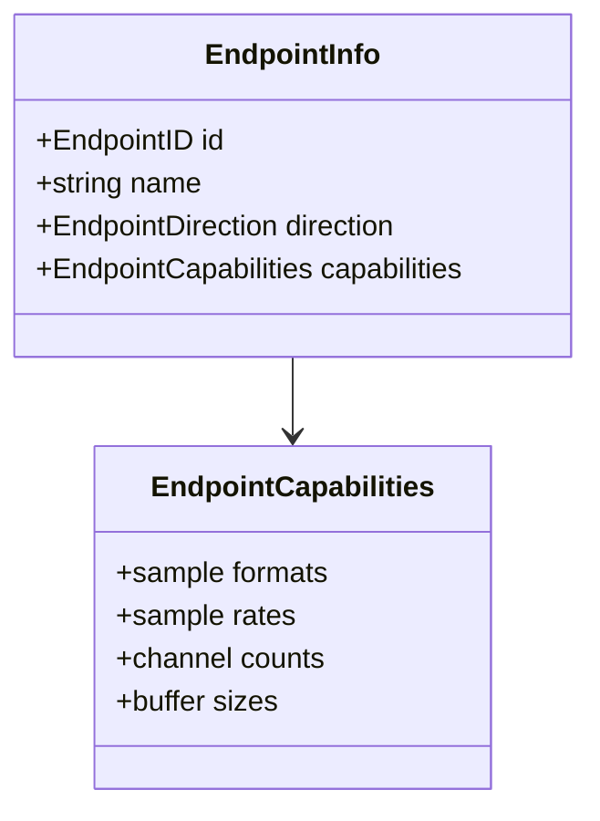
```mermaid
classDiagram
    class EndpointInfo {
        +EndpointID id
        +string name
        +EndpointDirection direction
        +EndpointCapabilities capabilities
    }

    class EndpointCapabilities {
        +sample formats
        +sample rates
        +channel counts
        +buffer sizes
    }

    EndpointInfo --> EndpointCapabilities
```

The framework does not require the application to construct large backend-specific device objects.

Instead, endpoint identity and capabilities are returned together through `EndpointInfo`.

---

# Endpoint discovery

Endpoint discovery is intentionally separated from opening an audio stream.

The endpoint list contains the information required to identify and configure each endpoint. Endpoint capabilities are therefore returned together with the endpoint rather than being queried through a second operation.

The general workflow is:

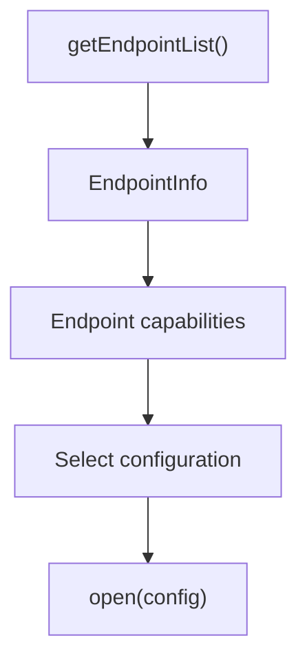
```mermaid
flowchart TD
    LIST["getEndpointList()"]
    INFO["EndpointInfo"]
    CAP["Endpoint capabilities"]
    CONFIG["Select configuration"]
    OPEN["open(config)"]

    LIST --> INFO
    INFO --> CAP
    CAP --> CONFIG
    CONFIG --> OPEN
```

This avoids an unnecessary request for every endpoint and keeps endpoint enumeration simple for the application.

The application can therefore:

1. Retrieve the available `EndpointInfo` objects.
2. Inspect each endpoint's identity, direction and capabilities.
3. Select an endpoint and configuration.
4. Open the endpoint.

---

# Endpoint direction

An endpoint is not necessarily unidirectional.

The abstraction supports three possible directions:

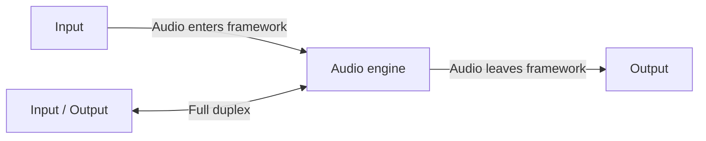
```mermaid
flowchart LR
    INPUT["Input"]
    OUTPUT["Output"]
    DUPLEX["Input / Output"]

    INPUT -->|"Audio enters framework"| ENGINE["Audio engine"]
    ENGINE -->|"Audio leaves framework"| OUTPUT

    DUPLEX <-->|"Full duplex"| ENGINE
```

This allows a backend to expose a full-duplex audio endpoint without requiring separate input and output device abstractions.

---

# Endpoint discovery API

The endpoint discovery API exposes all currently available endpoints together with the information required to use them.

Conceptually:

```cpp
std::vector<EndpointInfo> getEndpointList();
```

Each `EndpointInfo` contains the endpoint identity, direction and capabilities. No additional `getEndpointInfo()` call is required for normal endpoint discovery.

The returned information is descriptive: it allows the application to choose a valid configuration before calling `open()`.

---

# Configuration

Opening a stream is based on an explicit configuration.

The application specifies the parameters it wants rather than relying on an implicit configuration chosen by the backend.

Typical parameters include:

* input channel count
* output channel count
* sample rate
* buffer size
* sample format
* selected endpoint

Conceptually:

```cpp
DeviceConfig config{
    .endpointID      = "...",
    .sampleRate      = 48000,
    .bufferSize      = 256,
    .inputChannels   = 2,
    .outputChannels  = 2,
    .sampleFormat    = SampleFormat::Float32
};
```

The backend is responsible for determining whether that configuration can actually be provided.

A configuration mismatch must be reported explicitly rather than silently changing the requested parameters.

This keeps the behavior deterministic and prevents the application from unknowingly running with a different audio configuration.

---

# Configuration negotiation

The framework intentionally distinguishes **capability discovery** from **configuration validation**.

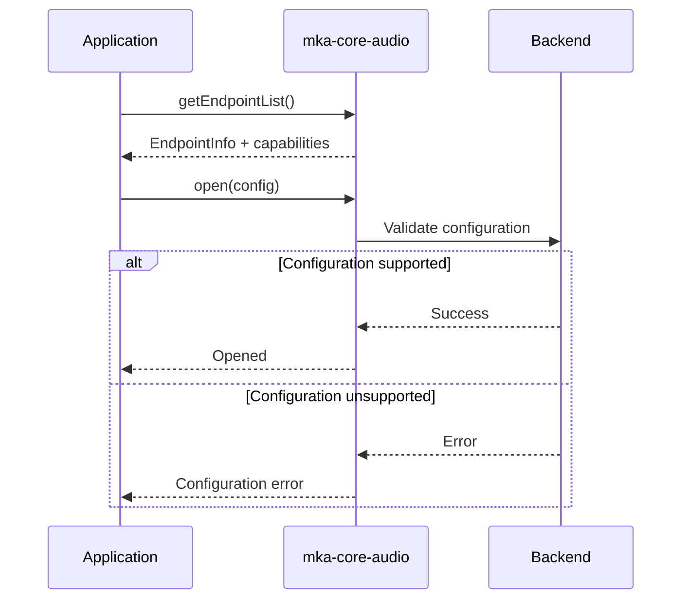
```mermaid
sequenceDiagram
    participant App as Application
    participant API as mka-core-audio
    participant Backend

    App->>API: getEndpointList()
    API-->>App: EndpointInfo + capabilities

    App->>API: open(config)
    API->>Backend: Validate configuration

    alt Configuration supported
        Backend-->>API: Success
        API-->>App: Opened
    else Configuration unsupported
        Backend-->>API: Error
        API-->>App: Configuration error
    end
```

The framework does not silently replace an unsupported configuration with another configuration.

If negotiation or validation fails, the caller receives an explicit error.

---

# Supported sample formats

The framework defines a backend-independent representation of sample formats.

Currently considered formats include:

```text
Int16
Int24
Int32
Float32
Float64
```

The backend may use a native representation internally.

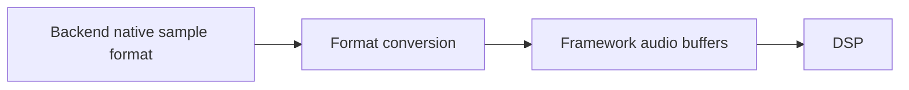
```mermaid
flowchart LR
    NATIVE["Backend native sample format"]
    CONVERT["Format conversion"]
    FRAMEWORK["Framework audio buffers"]
    DSP["DSP"]

    NATIVE --> CONVERT
    CONVERT --> FRAMEWORK
    FRAMEWORK --> DSP
```

The goal is to keep DSP code independent from the hardware's native sample representation.

---

# Planar audio buffers

The framework uses a **planar channel representation** at the processing boundary.

Instead of interleaved samples:

```text
L R L R L R L R
```

audio is represented as independent channel buffers:

```text
Channel 0:
L L L L L L

Channel 1:
R R R R R R
```

Conceptually:

```cpp
float* channels[] = {
    left,
    right
};
```

The memory model can be represented as:

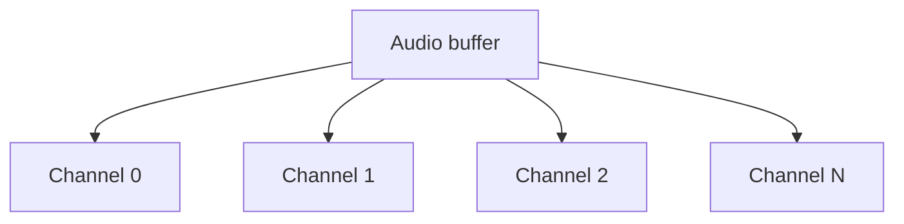
```mermaid
flowchart TD
    BUFFER["Audio buffer"]

    C0["Channel 0"]
    C1["Channel 1"]
    C2["Channel 2"]
    CN["Channel N"]

    BUFFER --> C0
    BUFFER --> C1
    BUFFER --> C2
    BUFFER --> CN
```

This representation has several advantages for DSP processing:

* direct per-channel processing
* predictable memory access
* easier SIMD/vectorization
* straightforward channel routing
* no interleaving/deinterleaving in DSP code

Backend-specific interleaved formats are converted at the backend boundary when necessary.

---

# Real-time processing

Real-time safety is one of the fundamental requirements of the project.

The audio processing path must be deterministic and must avoid operations that can introduce unpredictable latency.

The real-time path should therefore avoid:

* dynamic memory allocation
* deallocation
* mutex locking
* filesystem operations
* blocking I/O
* logging
* expensive system calls
* unbounded operations

The callback must operate only on resources prepared before the stream starts.

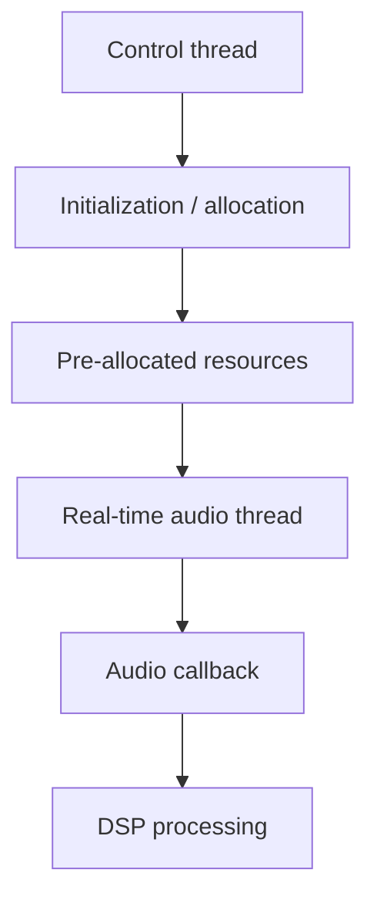
```mermaid
flowchart TD
    CONTROL["Control thread"]

    INIT["Initialization / allocation"]
    READY["Pre-allocated resources"]

    RT["Real-time audio thread"]
    CALLBACK["Audio callback"]
    DSP["DSP processing"]

    CONTROL --> INIT
    INIT --> READY
    READY --> RT
    RT --> CALLBACK
    CALLBACK --> DSP
```

Anything requiring allocation or potentially blocking behavior belongs outside the real-time path.

---

# Fixed-size processing blocks

One important architectural distinction is made between:

1. backend buffer size
2. framework processing block size
3. DSP-specific processing size
4. algorithmic window size

These are not necessarily the same thing.

The backend may provide buffers whose size differs from the framework's processing block.

The framework therefore acts as a boundary between the external audio world and the deterministic DSP world.

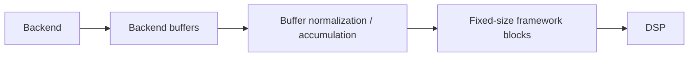
```mermaid
flowchart LR
    BACKEND["Backend"]
    BUFFER["Backend buffers"]
    NORMALIZE["Buffer normalization / accumulation"]
    BLOCKS["Fixed-size framework blocks"]
    DSP["DSP"]

    BACKEND --> BUFFER
    BUFFER --> NORMALIZE
    NORMALIZE --> BLOCKS
    BLOCKS --> DSP
```

This means DSP implementations do not need to individually handle backend-specific buffer irregularities.

The accumulation required to transform backend buffers into framework blocks belongs to the framework itself.

Algorithm-specific buffering remains the responsibility of the DSP component.

---

# Callback

Once a stream is running, audio processing is performed through a user-defined callback.

Conceptually:

```cpp
setCallback(callback);
```

The callback receives the audio buffers for the current processing block.

A simplified representation is:

```cpp
struct Buffer
{
    float** inputs;
    float** outputs;

    uint32_t inputCount;
    uint32_t outputCount;

    uint32_t frames;
};
```

The callback is executed from the real-time audio processing context.

Therefore, callback code must follow the same real-time constraints as the framework itself.

The callback processing flow is:

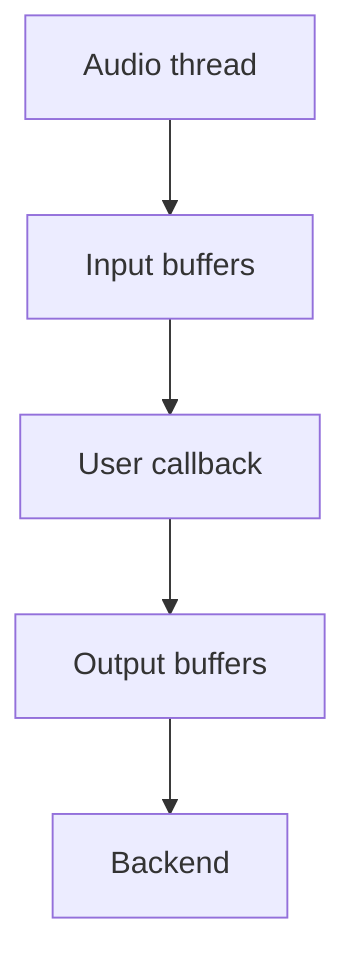
```mermaid
flowchart TD
    AUDIO["Audio thread"]
    INPUT["Input buffers"]
    CALLBACK["User callback"]
    OUTPUT["Output buffers"]
    BACKEND["Backend"]

    AUDIO --> INPUT
    INPUT --> CALLBACK
    CALLBACK --> OUTPUT
    OUTPUT --> BACKEND
```

---

# Stream lifecycle

The stream lifecycle is deliberately small.

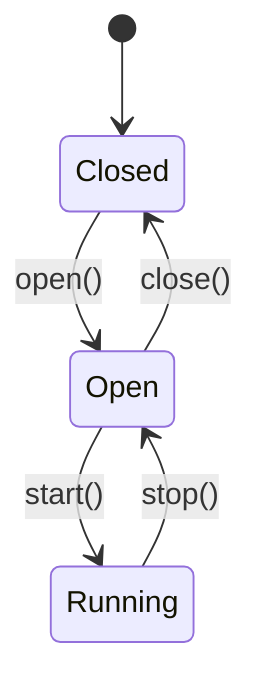
```mermaid
stateDiagram-v2
    [*] --> Closed

    Closed --> Open: open()
    Open --> Running: start()
    Running --> Open: stop()
    Open --> Closed: close()
```

The intended public operations are:

```text
open()
start()
stop()
close()
```

## `open()`

Creates and configures the stream using the requested configuration.

It may perform:

* endpoint validation
* backend resource creation
* format negotiation
* buffer allocation
* internal initialization

It must not silently substitute incompatible parameters.

## `start()`

Starts real-time processing.

After `start()`, the callback may be invoked by the backend.

## `stop()`

Stops real-time processing while keeping the stream open.

## `close()`

Releases resources associated with the stream.

The public API is designed so that lifecycle errors are returned as explicit error results rather than being communicated through exceptions.

---

# Error handling

The audio API uses explicit result/error reporting for operations that can fail.

This is particularly important for lifecycle functions such as:

```text
open
start
stop
close
```

Errors may originate from:

* invalid state transitions
* unsupported configurations
* unavailable endpoints
* backend failures
* stream negotiation failures
* allocation failures
* runtime audio errors

The real-time callback should not use exceptions as a normal control-flow mechanism.

---

# Endpoint capabilities

Each endpoint exposes the capabilities supported by the underlying backend.

These capabilities may include:

```text
Sample formats
Sample rates
Channel counts
Buffer sizes
Input support
Output support
```

Conceptually:

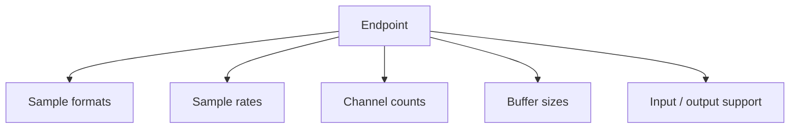
```mermaid
flowchart TD
    ENDPOINT["Endpoint"]

    FORMAT["Sample formats"]
    RATE["Sample rates"]
    CHANNELS["Channel counts"]
    BUFFER["Buffer sizes"]
    DIRECTION["Input / output support"]

    ENDPOINT --> FORMAT
    ENDPOINT --> RATE
    ENDPOINT --> CHANNELS
    ENDPOINT --> BUFFER
    ENDPOINT --> DIRECTION
```

The project keeps the supported framework-level values centralized rather than duplicating them across every backend implementation.
The backend reports the subset supported by each endpoint through `EndpointInfo`.

This allows backend implementations to use the same definitions when reporting or validating capabilities.

---

# Linux backends

Linux is currently the primary development platform.

The project targets several Linux audio systems.

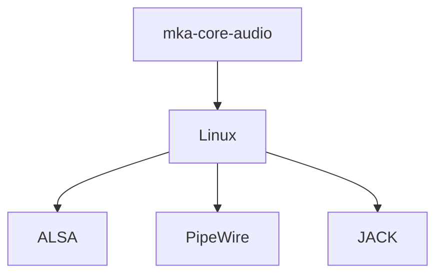
```mermaid
flowchart TD
    CORE["mka-core-audio"]

    LINUX["Linux"]

    ALSA["ALSA"]
    PIPEWIRE["PipeWire"]
    JACK["JACK"]

    CORE --> LINUX
    LINUX --> ALSA
    LINUX --> PIPEWIRE
    LINUX --> JACK
```

---

# ALSA

ALSA provides direct access to Linux PCM audio devices.

The ALSA backend is intended to provide:

* device enumeration
* hardware capability inspection
* full-duplex streams
* low-level buffer access
* mmap-based processing where appropriate
* native sample-format handling

ALSA is particularly useful when the framework needs direct and predictable access to an audio device.

A simplified architecture is:

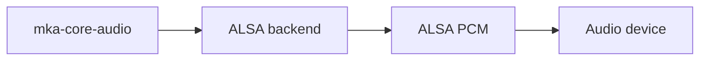
```mermaid
flowchart LR
    API["mka-core-audio"]
    ALSA_BACKEND["ALSA backend"]
    PCM["ALSA PCM"]
    DEVICE["Audio device"]

    API --> ALSA_BACKEND
    ALSA_BACKEND --> PCM
    PCM --> DEVICE
```

---

# PipeWire

PipeWire is supported as a higher-level Linux audio backend.

The backend uses PipeWire streams to integrate the framework with the PipeWire graph.

Conceptually:

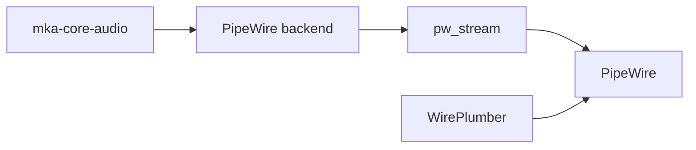
```mermaid
flowchart LR
    CORE["mka-core-audio"]
    BACKEND["PipeWire backend"]
    STREAM["pw_stream"]
    PW["PipeWire"]
    WP["WirePlumber"]

    CORE --> BACKEND
    BACKEND --> STREAM
    STREAM --> PW
    WP --> PW
```

PipeWire may provide different timing and buffering characteristics from a directly controlled ALSA stream.

The backend therefore handles the required buffering and conversion internally so that the public framework interface remains consistent.

---

# JACK

JACK is part of the intended Linux backend architecture.

Its port-oriented model fits naturally with the framework's endpoint abstraction and is particularly useful for routing audio between professional audio applications.

The framework should expose JACK-specific functionality through the generic endpoint API rather than requiring the application to depend directly on JACK.


```mermaid
flowchart LR
    APP["Application"]
    CORE["mka-core-audio"]
    JACK_BACKEND["JACK backend"]
    JACK["JACK"]
    PORTS["JACK ports"]

    APP --> CORE
    CORE --> JACK_BACKEND
    JACK_BACKEND --> JACK
    JACK --> PORTS
```

---

# Cross-platform backends

The architecture is intended to support additional native backends without changing the public audio API.

| Platform | Backend   |
| -------- | --------- |
| Linux    | ALSA      |
| Linux    | PipeWire  |
| Linux    | JACK      |
| Windows  | WASAPI    |
| macOS    | CoreAudio |

The exact implementation status of each backend may differ during development.

The abstraction is intentionally designed so that adding a backend does not require changes to the DSP layer.

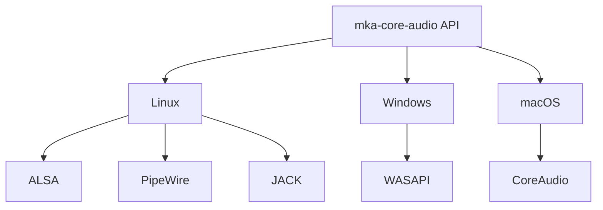
```mermaid
flowchart TD
    API["mka-core-audio API"]

    LINUX["Linux"]
    WINDOWS["Windows"]
    MACOS["macOS"]

    ALSA["ALSA"]
    PIPEWIRE["PipeWire"]
    JACK["JACK"]

    WASAPI["WASAPI"]
    COREAUDIO["CoreAudio"]

    API --> LINUX
    API --> WINDOWS
    API --> MACOS

    LINUX --> ALSA
    LINUX --> PIPEWIRE
    LINUX --> JACK

    WINDOWS --> WASAPI
    MACOS --> COREAUDIO
```

---

# Backend-independent design

A central design rule is:

> **Backend-specific code stays inside the backend.**

For example, DSP code should not contain:

```cpp
snd_pcm_*
pw_*
jack_*
IAudioClient*
AudioUnit*
```

Instead, it should only interact with framework-level concepts:

```cpp
Endpoint
EndpointInfo
DeviceConfig
Buffer
SampleFormat
Result
Callback
```

The separation can be represented as:

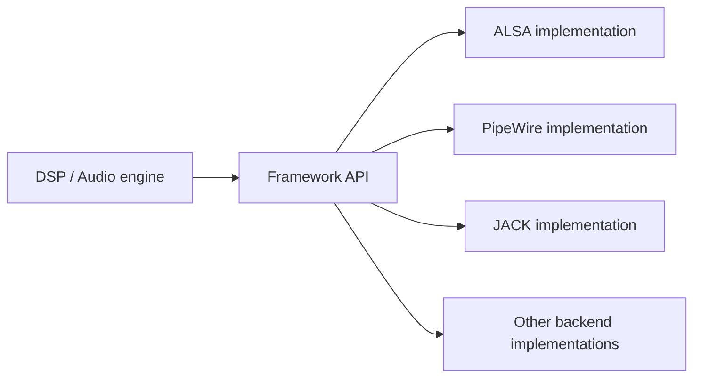
```mermaid
flowchart LR
    DSP["DSP / Audio engine"]

    API["Framework API"]

    ALSA["ALSA implementation"]
    PIPEWIRE["PipeWire implementation"]
    JACK["JACK implementation"]
    OTHER["Other backend implementations"]

    DSP --> API

    API --> ALSA
    API --> PIPEWIRE
    API --> JACK
    API --> OTHER
```

This keeps the audio engine portable.

---

# Threading model

The framework separates control operations from real-time processing.

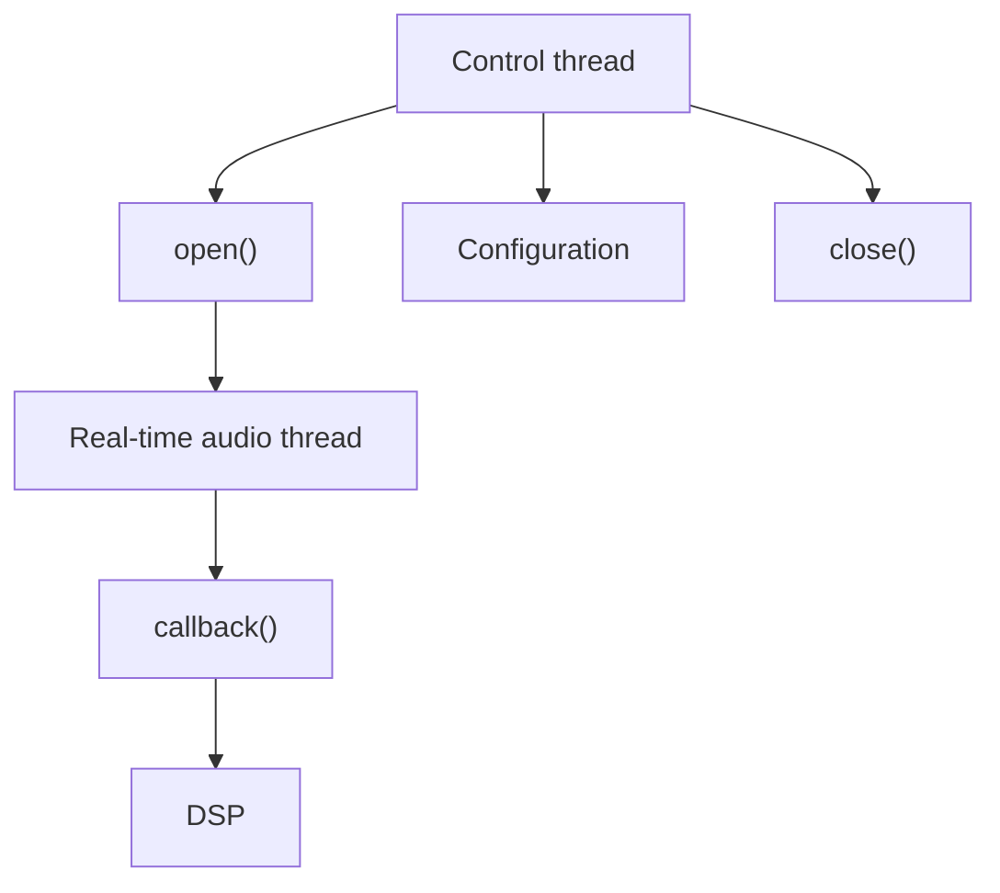
```mermaid
flowchart TD
    CONTROL["Control thread"]

    OPEN["open()"]
    CONFIG["Configuration"]
    CLOSE["close()"]

    RT["Real-time audio thread"]
    CALLBACK["callback()"]
    DSP["DSP"]

    CONTROL --> OPEN
    CONTROL --> CONFIG
    CONTROL --> CLOSE

    OPEN --> RT
    RT --> CALLBACK
    CALLBACK --> DSP
```

Control operations may allocate memory, communicate with the operating system and perform backend-specific setup.

The audio thread must operate on resources prepared beforehand.

---

# Control plane and audio plane

The architecture can be understood as two separate planes.

```mermaid
flowchart TB
    subgraph CONTROL["Control plane"]
        ENUM["Endpoint discovery + capabilities"]
        CONFIG["Configuration"]
        OPEN["Open / close"]
        START["Start / stop"]
    end

    subgraph AUDIO["Real-time audio plane"]
        CALLBACK["Audio callback"]
        BUFFER["Audio buffers"]
        DSP["DSP processing"]
    end

    CONTROL --> AUDIO
```

The control plane manages the lifetime and configuration of the audio system.

The audio plane processes samples under strict real-time constraints.

This separation is fundamental to the architecture.

---

# Project structure

The project is organized around a separation between the public abstraction and backend implementations.

A conceptual structure is:

```text
src/
├── abstract_core.cppm
│
├── utils/
│   ├── config.cppm
│   ├── constants.cppm
│   └── error.cppm
│
└── impl/
    ├── alsa_impl.cppm
    ├── pipewire_impl.cppm
    └── ...
```

The exact directory structure is expected to evolve with the implementation.

---

# C++ standard

The project targets modern C++ and currently uses **C++26**.

The implementation makes use of C++ modules to organize the framework.

The architecture is based around modules such as:

```text
audio.abstract_core
audio.config
audio.constants
audio.error
audio.alsa
audio.pipewire
...
```

The exact module organization may evolve as the project matures.

---

# Design principles

The project follows a few simple principles.

## KISS

Keep the public API small.

The framework should expose the concepts required by an audio engine without reproducing every concept of every backend.

## YAGNI

Backend-specific features should not become part of the abstraction unless they are genuinely required.

## Real-time first

Anything that can compromise deterministic audio processing must be isolated from the real-time path.

## Backend independence

The application should not need to know whether audio is ultimately provided by ALSA, PipeWire, JACK, CoreAudio or WASAPI.

## Explicit behavior

Configuration, state transitions and errors should be explicit rather than implicit.

## Pre-allocation

Memory required by the audio processing path should be prepared before entering the real-time state.

## Separation of responsibilities

Backend adaptation, buffer normalization and DSP processing are distinct responsibilities and should remain separate.

---

# Development status

The project is currently under active development.

The architecture is being established before expanding the number of supported backends.

Current development priorities include:

* [x] Define backend abstraction
* [x] Define stream lifecycle
* [x] Define endpoint-oriented architecture
* [x] Define combined endpoint information and capability model
* [x] Define configuration model
* [x] Define sample-format abstraction
* [x] Define callback model
* [ ] Finalize endpoint capability representation
* [ ] Finalize real-time buffer abstraction
* [ ] Implement complete ALSA backend
* [ ] Implement complete PipeWire backend
* [ ] Implement JACK backend
* [ ] Implement fixed-size framework block accumulation
* [ ] Add comprehensive backend tests
* [ ] Add real-time safety tests
* [ ] Add performance/latency benchmarks
* [ ] Add Windows backend
* [ ] Add macOS backend

The API is expected to change while the architecture is being validated.

---

# Future architecture

The long-term goal is to use `mka-core-audio` as the foundation of a complete audio engine.

A possible future architecture is:

```mermaid
flowchart TD
    DAW["DAW"]

    PROJECT["Project"]
    UI["UI layer"]

    ENGINE["Audio engine"]

    GRAPH["Audio graph"]
    SCHEDULER["Scheduler"]

    CORE["mka-core-audio"]

    ALSA["ALSA"]
    PIPEWIRE["PipeWire"]
    JACK["JACK"]
    WASAPI["WASAPI"]
    COREAUDIO["CoreAudio"]

    DAW --> PROJECT
    DAW --> UI
    DAW --> ENGINE

    ENGINE --> GRAPH
    ENGINE --> SCHEDULER

    GRAPH --> CORE
    SCHEDULER --> CORE

    CORE --> ALSA
    CORE --> PIPEWIRE
    CORE --> JACK
    CORE --> WASAPI
    CORE --> COREAUDIO
```

The audio layer should remain independent from the higher-level DAW graph, UI and project-management systems.

---

# Why build another audio abstraction?

Existing audio frameworks solve many of the same problems, but this project has a different objective:

**to build the complete stack from first principles and maintain full control over the architecture.**

The project is therefore intentionally focused on:

* understanding the underlying audio systems
* controlling the real-time architecture
* minimizing abstraction overhead
* keeping the public API small
* learning how professional audio pipelines actually work
* creating a foundation that can later be integrated into a custom DAW

This is an engineering project as much as it is a reusable library.

---

# Non-goals

The project is not intended to:

* replace a DSP library
* provide a complete DAW by itself
* expose every feature of every backend
* hide all platform-specific behavior at any cost
* perform non-real-time audio processing inside the callback
* provide a GUI
* provide plugin hosting by itself

Those responsibilities belong to higher layers of the future audio stack.

---

# Performance philosophy

Audio performance is not measured solely by raw throughput.

The framework prioritizes:

1. deterministic execution
2. predictable memory access
3. bounded processing time
4. low latency
5. minimal synchronization
6. backend-independent behavior

A slightly more complex architecture is acceptable when it prevents backend irregularities from leaking into every DSP component.

The goal is therefore not simply:

```text
"process audio as fast as possible"
```

but rather:

```text
"process audio predictably, continuously and with bounded latency"
```

---

# License

License information has not yet been finalized.
